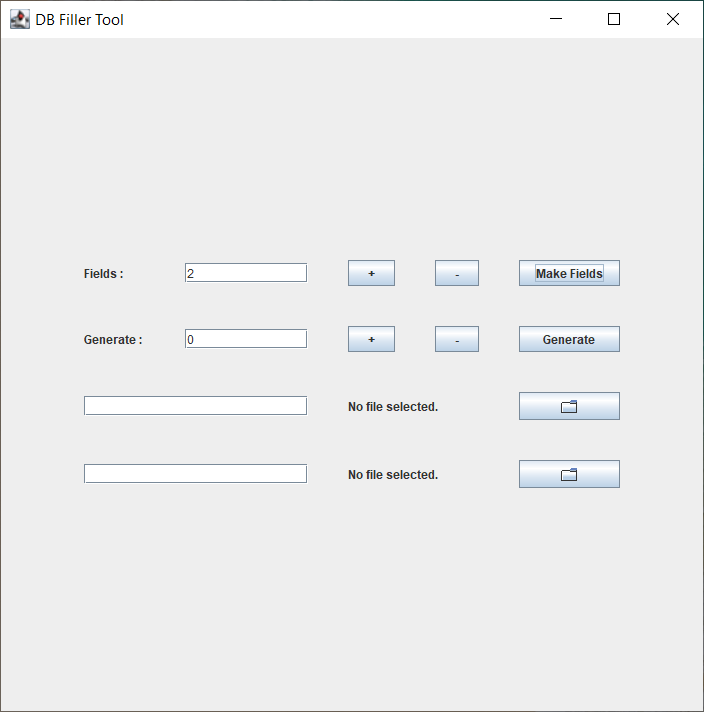
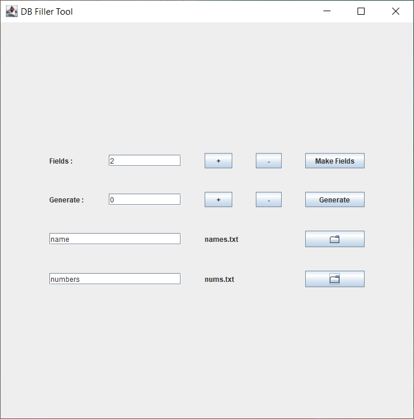
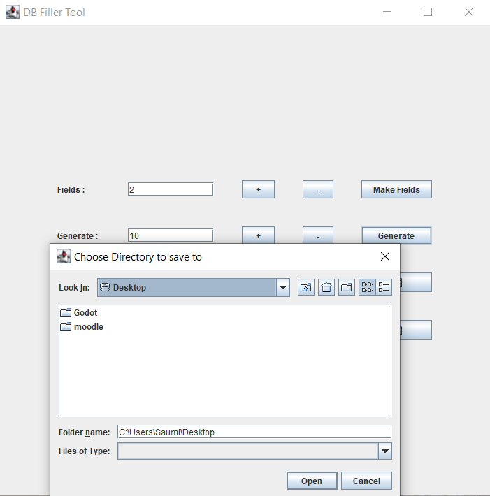

# DB_Filler

This tool was created to create sample JSON data to fill a database.

## Building
  Use Eclipse to open the folder and build/run.
  
## How to use it

  1) Run the Launcher class or the .jar file.
  2) Select the number of columns (fields) in your database, then click "Make Fields".
  3) Give name to each column in the respective text fields.
  4) Click on browse button to add a file.
  5) The selected file must contain values for the column (new values on new lines).
  6) Finally type how many entries you would like to create.
  7) Click generate, select where you would like to save the created entries.
  8) There will be a new file in your selected folder containing the entries.
  
## Example usage

   1) Add required number of fields.
  

  
   2) Fill name of columns and select files.
    


   3) Click generate and choose where to save.



   4) Output : <br>
    ```
    { "name" : "Unogzl", "numbers" : "6693" }  
    { "name" : "Jftzww", "numbers" : "5177" }  
    { "name" : "Gfrfwk", "numbers" : "3139" } 
    { "name" : "Twgcym", "numbers" : "2368" } 
    { "name" : "Jmriij", "numbers" : "7453" } 
    { "name" : "Kozwmi", "numbers" : "9434" }
    { "name" : "Ywqqcc", "numbers" : "1315" }
    { "name" : "Eiuwzq", "numbers" : "0622" }
    { "name" : "Pzuvjt", "numbers" : "5433" }
    { "name" : "Rxoagq", "numbers" : "3211" }
    ```
